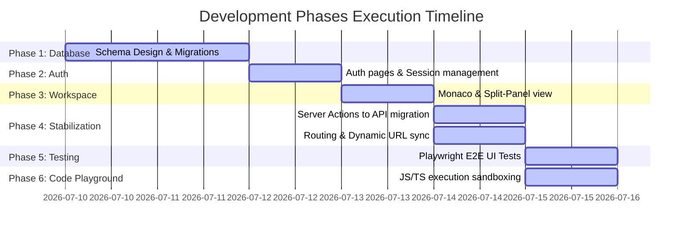

# JSON Blob SaaS: Phase-wise Development & Build Documentation

This document outlines the step-by-step development process and architectural evolution of the JSON Blob SaaS application.

---

## Development Roadmap & Execution Phases

---

### Phase 1: Database Architecture & migrations
- **Goal**: Design a high-performance database schema compatible with Cloudflare's D1 distributed SQLite storage.
- **Tasks Completed**:
  - Defined the `users` table storing encrypted passwords, names, and emails.
  - Defined the `blobs` table storing unique JSON document UUIDs, titles, contents, and update timestamps, linked to the creator.
  - Generated migrations via Drizzle DDL compiler:
    - [0000_wild_sister_grimm.sql](file:///home/bnaveen/jsonblob/drizzle/0000_wild_sister_grimm.sql) (Initial blobs table)
    - [0001_bumpy_queen_noir.sql](file:///home/bnaveen/jsonblob/drizzle/0001_bumpy_queen_noir.sql) (Added users relationship schema)

---

### Phase 2: Authentication Core
- **Goal**: Implement secure access control for personal JSON workspaces.
- **Tasks Completed**:
  - Developed user registration and login interfaces.
  - Integrated password hashing for secure authentication.
  - Formed a client-side session bridge using `localStorage` (`user_name`, `user_email`) mapped to custom user initials badges.

---

### Phase 3: Workspace Frontend & Monaco Editor
- **Goal**: Create a feature-rich, high-performance editor layout.
- **Tasks Completed**:
  - Embedded Monaco Editor with support for automatic resizing and folding.
  - Developed custom toolbar operations: JSON Beautify (formatter), syntax validator, copy-to-clipboard, file exporter (downloader), and workspace resets.
  - Implemented the right panel featuring Tree View parsing and live JSON Diff highlights.

---

### Phase 4: Edge Runtime Stabilization & Migration
- **Goal**: Resolve Edge deployment runtime issues.
- **Critical Resolutions**:
  1. **Server Actions Bypass**: Initial reliance on dynamic page Server Actions (`updateBlobAction`, `deleteBlobAction`) triggered recurrent `405 Method Not Allowed` and `404 Not Found` exceptions on dynamic Edge pages under `@cloudflare/next-on-pages`. Migrated all database interactions to standardized `/api/blobs` and `/api/blobs/[id]` endpoints.
  2. **Route Synchronizer**: Removed buggy manual `window.history.pushState` manipulation. Replaced it with Next.js's standard `router.push()` inside `BlobDashboard.tsx` to maintain perfect sync with the client routing router.
  3. **Auth dynamic page wrap**: Replaced static `/auth` pages with dynamic wrapper wrappers to prevent Edge compilation warnings.

---

### Phase 5: Automated Testing
- **Goal**: Build automated verification suites for regression testing.
- **Tasks Completed**:
  - Developed an API-level integration test suite ([test-e2e-suite.js](file:///home/bnaveen/jsonblob/test-e2e-suite.js)).
  - Built and integrated Playwright browser test suite ([run-playwright-test.js](file:///home/bnaveen/jsonblob/run-playwright-test.js)) to automate logins, CRUD, autosaves, formats, copies, downloads, resets, and deletions in a real browser.

---

### Phase 6: Code Playground and TypeScript Integration
- **Goal**: Transform the platform into an interactive playground supporting JavaScript and TypeScript.
- **Tasks Completed**:
  - **Database Migration**: Designed and applied the `snippets` schema migration (`0002_add_snippets_table.sql`) to D1 for storing code files.
  - **CRUD API Routing**: Implemented dynamic `/api/snippets` and `/api/snippets/[id]` routes.
  - **Pluggable Execution Adapters**:
    - Defined a generic `LanguageAdapter` contract.
    - Built a `javascriptAdapter` running code in sandboxed client Web Workers to intercept logs and prevent browser freezes.
    - Built a `typescriptAdapter` that transpiles TypeScript (strips annotations, types, interfaces, typecasts) in-browser and executes the output inside the sandboxed Web Worker.
  - **Zustand State Store**: Developed `playgroundStore` to manage multiple tabs, console logs, theme configuration, autosaves, and database synchronization.
  - **IDE Layout**: Implemented `/playground` workspace featuring:
    - Sidebar Explorer with saved snippets lists, quick templates, and search filters.
    - Collapsible bottom Console with clean functions, status indicators, and execution times.
    - Main Monaco editor area with tab bars, filename renaming inputs, and toolbar controls.
  - **Automation Tests**:
    - Created `test-playground-suite.js` to assert backend API CRUD.
    - Created `run-playground-browser-test.js` to simulate Monaco typing, formatting, sandboxed log capture, runtime error reporting, and snippet database saving.

---

### Phase 7: Pluggable Runtime Architecture & Console Refactoring
- **Goal**: Refactor the execution engine into a pluggable runtime architecture supporting JavaScript, TypeScript, Python, and Java with robust sandboxing, local execution fallbacks, and a tabbed console interface.
- **Tasks Completed**:
  - **Language Runtime Manager**: Created `lib/runtime/runtimeManager.ts` to manage execution runtimes dynamically. Registered dedicated engines for JavaScript, TypeScript, Python, and Java.
  - **Tabbed Console Interface**: Redesigned `components/playground/Console.tsx` into a tabbed console, separating Output, Compilation Errors, Runtime Errors, and Warnings. Added clear indicators and visual themes.
  - **Python Pyodide Web Runtime**: Implemented client-side Python execution in `lib/runtime/runtimes/pythonRuntime.ts` using Pyodide (WebAssembly Python VM). Added a fast-failing timeout check to switch seamlessly to a client-side transpiler Web Worker fallback when network/CDN requests are slow or blocked.
  - **Java Piston API Integration**: Connected Java compilation and execution to EMKC's Piston API in `lib/runtime/runtimes/javaRuntime.ts`. Implemented a robust local transpiler-to-JavaScript Web Worker fallback to guarantee seamless execution even if the remote Piston API returns 401 Unauthorized or has connectivity issues.
  - **Playwright Coverage Tests**: Created the complete E2E test runner (`test-playground-complete-e2e.js`) validating 19 core playground behaviors, including all runtime executions, console output assertions, state isolation, tab switching, and sandboxed infinite-loop protection.

