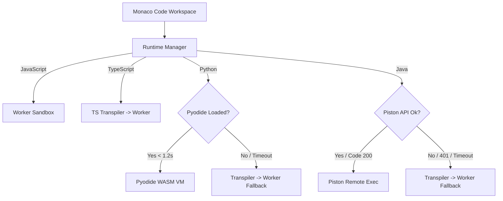

# JSON Blob SaaS & Code Playground: Core Features Documentation

This document compiles and describes all the features and capabilities implemented in the **JSON Blob SaaS** and integrated **Code Playground** platform.

---

## 1. System Architecture & Foundation
The platform is engineered as a premium, edge-optimized, developer-first workspace designed for speed, security, and developer productivity.

* **Edge-Optimized Framework**: Built with **Next.js** (App Router) and compiled via `@cloudflare/next-on-pages` for deployment on Cloudflare Pages.
* **Distributed Database Layer**: Uses **Drizzle ORM** communicating with **Cloudflare D1**, a globally distributed SQLite-compatible database ensuring low-latency operations.
* **State Management**: Orchestrated via **Zustand** (`usePlaygroundStore`) to manage workspace tabs, console outputs, runtime environments, and autosaves.
* **Dual Theme Design**: Vanilla CSS combined with custom Tailwind CSS v4 variables supporting professional dark and light themes.

---

## 2. JSON Blob Workspace
A feature-rich JSON editor designed to format, check, and inspect JSON documents in real-time.

| Feature | Description |
| :--- | :--- |
| **Monaco Editor Core** | Embedded VS Code Monaco Editor supporting code folding, line numbering, word wrap, and automatic layout resizing. |
| **JSON Beautification** | Automatically formats and indents compressed JSON configurations using `JSON.stringify(..., null, 2)`. |
| **Syntax Validation** | Real-time parser checking JSON structure and showing inline errors with precise row/column details. |
| **Tree View Inspector** | Renders JSON data as an interactive tree structure for scanning nested fields and hierarchies. |
| **JSON Diff Viewer** | Displays line-by-line differences between local modifications and the original saved state. |
| **Autosave Engine** | 1.5-second debounced background synchronization to Cloudflare D1 with a visual spinner. Supports manual override saves. |
| **Export & Clipboard** | One-click copy to system clipboard and export as a download file (`.json`). |

---

## 3. Secure User Authentication & Isolation
Robust multi-tenant separation ensures that user workspaces and templates remain secure and isolated.

* **HttpOnly Session Authentication**: User authentication matches secure backend cookies (`userId`) generated on register/login and deleted on logout.
* **Multi-Tenant Data Isolation**: Database tables enforce ownership checking. API routes inspect cookies to ensure users can only CRUD their own data.
* **Dynamic Workspace Sidebar**:
  * **My Blobs**: Personal saved documents, sorted by update history. Includes prompts for guests and empty states for new users.
  * **Templates**: Access to public, read-only starter presets.
* **Sign Out Integrity**: Clean session termination that clears cookies, client-side local/session storage, and Zustand memory stores.

---

## 4. Multi-Language Code Playground
The Code Playground transforms the platform into an interactive execution sandbox for testing and running code.

### Key Execution Capabilities
1. **Unified Pluggable Runtime**: Pluggable architecture managed by `RuntimeManager` supporting JavaScript, TypeScript, Python, and Java.
2. **Tabbed Console Interface**: Consolidates stdout, stderr, compilation errors, and warnings into separate workspace tabs.
3. **Execution Sandboxing**:
   * Runs local code inside secure browser **Web Workers** to protect the UI thread.
   * **Timeout Guard**: Kills loops after 3 seconds to protect CPU resources.
4. **Resilient Local Fallbacks**:
   * **Python Fallback**: If Pyodide CDN takes > 1.2 seconds, it falls back to transpiling Python into JavaScript to run in the local worker.
   * **Java Fallback**: If the Piston engine returns 401 or network drops, it transpiles Java classes to JavaScript to run locally.
5. **Multi-Tab Editor Workspace**: Supports editing multiple files simultaneously with renaming fields and dirty-state indicators.
6. **Shareable Snippet Links**: Generates URLs (`?code=...&lang=...`) that reconstruct workspace code and language configurations instantly.

---

## 5. AI Developer Assistant Sidebar
An integrated conversational AI partner that has direct visibility of the developer's current context.

> [!NOTE]
> The AI Assistant is edge-optimized to execute on Cloudflare Pages Edge routes (`/api/ai`).

* **Context-Aware Design**: Automatically collects active Monaco editor code, compiler diagnostics, and console logs, injecting them into requests.
* **Chat Sidebar interface**: Supports markdown answers and one-click code insertion back into the active workspace.
* **Contextual Tools Toolbar**:
  * **Explain Code**: Generates architectural explanations.
  * **Find Bugs**: Runs code audits, capturing structural issues and edge cases.
  * **Optimize**: Suggests performance and efficiency improvements.
  * **Explain Errors**: Diagnoses runtime exceptions and compiler diagnostics.
  * **Generate Tests**: Provides testing templates for the code.
  * **Add Comments**: Inserts inline documentation comments.

---

## 6. Layout & Responsiveness
* **Mobile View Adaptation**: Responsive CSS breakpoints optimized for phones, tablets, and desktop displays.
* **Autosave Control**: A toggle selector enabling developers to turn off background database synchronization on demand.
* **Relocated Primary Actions**: Cleaned headers, relocated workspace creation flows, and unified toolbar setups.

---

## 7. Cloudflare D1 Studio (SQL Workspace)
A robust workspace for running SQLite and Cloudflare D1 SQL queries, exploring database schemas, and managing query templates.

| Feature | Description |
| :--- | :--- |
| **SQL Sandbox Engine** | Interactive SQLite SQL execution environment supporting standard DDL/DML (`CREATE TABLE`, `INSERT`, `SELECT`, `UPDATE`, `DELETE`, etc.). |
| **Database & Schema Browser** | Sidebar panel listing available databases, visual schema navigation (tables, columns, and column data types), and quick actions. |
| **Query Templates & Favorites** | Save frequently used SQL scripts with custom titles. Pin important queries using the "Add to Favorites" star toggle. |
| **Interactive Results Grid** | Displays executed query results in a clean table layout with pagination controls. |
| **Export Formats** | One-click export of SQL query output to clean CSV or structured JSON formats. |
| **Workspace Redirection** | Direct transition of query outputs to a new JSON workspace via the "Save as Blob" integration. |

---

## 8. Format Converter Studio
An advanced conversion workbench integrated directly into the workspace workflow.

* **CSV to JSON Parsing**: Converts multi-line comma-separated records into clean, validated JSON arrays/objects automatically.
* **Workspace Loader**: Seamlessly loads converted JSON output directly into the main JSON Editor workspace, bypassing copy-paste.
* **Resilient Split View**: Implements side-by-side Monaco Editors for raw input and formatted output layout.

---

## 9. AI Assistant Hardening & Fallback
* **AI Configuration Protection**: Graceful fallback mechanism in `/api/ai` that intercepts requests when the `GEMINI_API_KEY` is missing and returns a friendly `"AI is not configured"` notice instead of crashing.
* **Global Open State**: Manages panel open state across dashboard, SQL, and Workspace views using a shared global Zustand store.

---

## 10. Verification Test Suites
The platform features an automated quality-assurance test suite:

* **API End-to-End Tests** (`test-e2e-suite.js`): Asserts HTTP REST API constraints and validation states.
* **Playwright Browser UI Tests** (`run-playwright-test.js`): Simulates real browser login, workspace operations, and sync flows.
* **Playground Coverage Tests** (`test-playground-complete-e2e.js`): Asserts all 19 behaviors of the runtime engines, console tabs, and sandbox limits.
* **AI Tool Integration Tests** (`test-all-ai-features.js`): Checks response formats and prompt schemas for all AI actions.
* **Advanced Workspace E2E Tests** (`test-advanced-workspace.js`): Hardened Playwright verification covering the full lifecycle of D1 databases, query creation, sandbox execution, AI fallback notices, formatting conversion, and Workspace editor loading.
