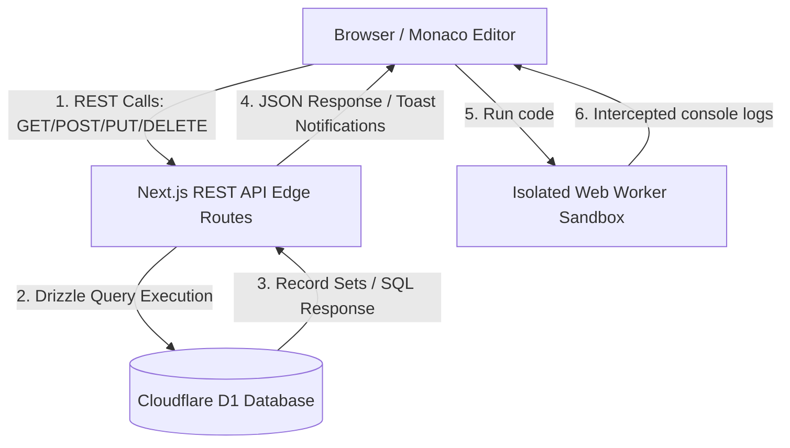

# JSON Blob SaaS: Application Overview

JSON Blob SaaS is a premium, edge-optimized, developer-oriented web application designed to create, format, validate, share, and manage JSON documents and multi-language code snippets in real-time. Built specifically for high-performance deployment on Cloudflare Pages, the platform utilizes Next.js and Cloudflare's D1 distributed database to ensure ultra-low latency globally.

---

## 1. Core Technology Stack

- **Framework**: Next.js (App & Page Routing) optimized for Cloudflare Pages Edge runtime via `@cloudflare/next-on-pages`.
- **Database ORM**: Drizzle ORM communicating with Cloudflare D1 distributed SQLite-compatible database.
- **Editor Core**: Monaco Editor (`@monaco-editor/react`) providing VS Code-like syntax highlighting, formatting, autocompletion, and inline error checking for JSON, JavaScript, and TypeScript.
- **State Store**: Zustand global state management store (`usePlaygroundStore`) handling workspace tabs, consoles, execution logs, and autosaves.
- **Styling**: Vanilla CSS combined with custom Tailwind v4 utilities for professional Dark/Light themes.
- **State & Routing**: Standard React context coupled with Next.js client-side navigation handlers.

---

## 2. Platform Architecture

The architecture consists of a highly optimized Edge API layer communicating with the Cloudflare D1 SQL database, supporting standard RESTful client operations:

---

## 3. Product Features

### A. Real-Time Editor Workspace
- **VS Code-grade Editor**: Full Monaco Editor features, including folding, line numbers, word-wrap, and automatic layout adjustments.
- **JSON Formatting (Beautify)**: Prettifies condensed or unformatted JSON strings using standard indented styling (`JSON.stringify(..., null, 2)`).
- **JSON Validation**: Real-time syntax parser showing line-and-column warnings on invalid syntax structure.
- **Stat Indicators**: Live counter displaying line counts and document size in Kilobytes (KB).

### B. Split-Pane Layout Utilities
- **Tree View**: Renders the raw JSON string as an interactive object inspector, enabling rapid hierarchy scanning.
- **JSON Diff Viewer**: Visually highlights line-by-line differences between local unsaved modifications and the original database-saved state.

### C. Automated Data Synchronization
- **Debounced Autosave**: Automatic background data synchronization to Cloudflare D1 database after 1.5 seconds of user typing inactivity, equipped with a visual loading spinner.
- **Manual Control overrides**: Quick access buttons to force manual saves, clear workspace contents, or reset the workspace to the saved state.

### D. User Management & Authenticated Storage
- **Security Action Forms**: Fully functional user registration and login pages.
- **Dynamic Personal Sidebar**: Authenticated users load a personal reverse-chronological list of saved workspaces, searchable instantly.
- **Clipboard & Export**: Quick buttons to copy raw content to the system clipboard or download the document as a `.json` file.

---

## 4. Code Playground Module

The Code Playground transforms JSON Blob into a fully featured developer sandbox supporting JavaScript (ES6+) and TypeScript.

### A. Pluggable Runtime Adapters
- **Extensible Architecture**: Defined `LanguageAdapter` contract allowing any new language or interpreter to be plugged in by registering its runner in the adapter registry.
- **JavaScript Adapter**: Directly targets high-speed V8 execution locally.
- **TypeScript Adapter**: Automatically transpiles TS syntax (interfaces, types, assertions) inside the client browser, running clean compiled JS in the output worker.

### B. Safe Worker Sandboxing
- **Main Thread Protection**: Code runs inside an isolated, Web Worker pool thread. Infinite loops (e.g. `while(true)`) or heavy processes do not hang the main browser workspace.
- **Console Capture**: Intercepts and parses standard `console.log`, `console.warn`, and `console.error` streams to print them colorfully in the bottom output panel.
- **Timeout Guard**: Kills execution tasks if they exceed 5 seconds, avoiding resource leaks.

### C. Advanced IDE UI Features
- **Multi-Tab Workspace**: Open multiple files concurrently. Workspace shows file titles, dirty flags, and quick close indicators.
- **Snippet Database Library**: Load, save, edit, duplicate, and delete snippets. All snippets are persistable in Cloudflare D1 with automatic page sync.
- **Shareable Links**: Share complete code workspaces with others using instant query strings (e.g. `?code=...&lang=...`). The page automatically imports and sets up the workspace.
- **Collapsible Console**: View logs, execution times, and errors. Offers one-click clear functions.
