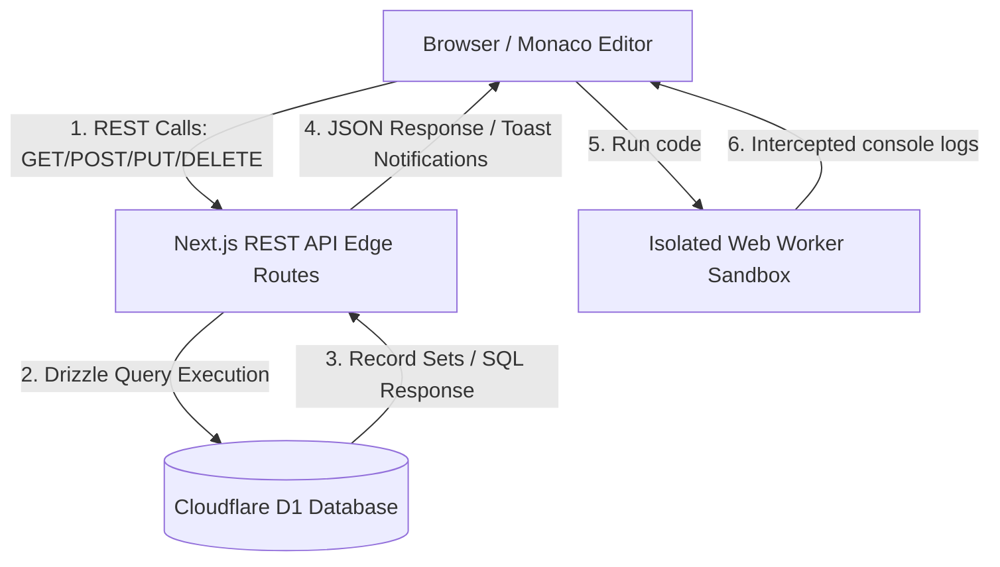

# JSON Blob SaaS: Application Overview

JSON Blob SaaS is a premium, edge-optimized, developer-oriented web application designed to create, format, validate, share, and manage JSON documents and multi-language code snippets in real-time. Built specifically for high-performance deployment on Cloudflare Pages, the platform utilizes Next.js and Cloudflare's D1 distributed database to ensure ultra-low latency globally.

---

## 1. Core Technology Stack

- **Framework**: Next.js (App & Page Routing) optimized for Cloudflare Pages Edge runtime via `@cloudflare/next-on-pages`.
- **Database ORM**: Drizzle ORM communicating with Cloudflare D1 distributed SQLite-compatible database.
- **Editor Core**: Monaco Editor (`@monaco-editor/react`) providing VS Code-like syntax highlighting, formatting, autocompletion, and inline error checking for JSON, JavaScript, and TypeScript.
- **State Store**: Zustand global state management store (`usePlaygroundStore`) handling workspace tabs, consoles, execution logs, and autosaves.
- **Styling**: Vanilla CSS combined with custom Tailwind v4 utilities for professional Dark/Light themes.
- **State & Routing**: Standard React context coupled with Next.js client-side navigation handlers.

---

## 2. Platform Architecture

The architecture consists of a highly optimized Edge API layer communicating with the Cloudflare D1 SQL database, supporting standard RESTful client operations:

---

## 3. Product Features

### A. Real-Time Editor Workspace
- **VS Code-grade Editor**: Full Monaco Editor features, including folding, line numbers, word-wrap, and automatic layout adjustments.
- **JSON Formatting (Beautify)**: Prettifies condensed or unformatted JSON strings using standard indented styling (`JSON.stringify(..., null, 2)`).
- **JSON Validation**: Real-time syntax parser showing line-and-column warnings on invalid syntax structure.
- **Stat Indicators**: Live counter displaying line counts and document size in Kilobytes (KB).

### B. Split-Pane Layout Utilities
- **Tree View**: Renders the raw JSON string as an interactive object inspector, enabling rapid hierarchy scanning.
- **JSON Diff Viewer**: Visually highlights line-by-line differences between local unsaved modifications and the original database-saved state.

### C. Automated Data Synchronization
- **Debounced Autosave**: Automatic background data synchronization to Cloudflare D1 database after 1.5 seconds of user typing inactivity, equipped with a visual loading spinner.
- **Manual Control overrides**: Quick access buttons to force manual saves, clear workspace contents, or reset the workspace to the saved state.

### D. User Management & Authenticated Storage
- **Security Action Forms**: Fully functional user registration and login pages.
- **Dynamic Personal Sidebar**: Authenticated users load a personal reverse-chronological list of saved workspaces, searchable instantly.
- **Clipboard & Export**: Quick buttons to copy raw content to the system clipboard or download the document as a `.json` file.

---

## 4. Code Playground Module

The Code Playground transforms JSON Blob into a fully featured developer sandbox supporting JavaScript (ES6+), TypeScript, Python, and Java.

### A. Pluggable Runtime Architecture & Registry
- **Unified Interface**: Defined a strict `LanguageRuntime` interface and managed centrally by `RuntimeManager` (registered in `lib/runtime/runtimeManager.ts`).
- **Dynamic Selection**: Language adapters dynamically check the selected editor language and route execution to the appropriate runtime engine.
- **JavaScript Engine**: Directly targets V8 execution inside isolated Web Workers.
- **TypeScript Engine**: Transpiles TypeScript in-browser via compiler tools and delegates compiled JS execution to the sandbox worker.
- **Python Engine (Pyodide)**: Runs Python scripts locally using a WebAssembly-compiled Pyodide VM instance loaded dynamically.
- **Java Engine (Piston REST API)**: Compiles and runs Java code remotely by calling EMKC's Piston API.

### B. High-Reliability Local Fallbacks
- **Internet / Permission Resilience**: To prevent failures due to network issues, rate limits, or restricted APIs (e.g. Piston API returning HTTP 401), both Python and Java execution paths feature intelligent local fallbacks.
- **Java Fallback**: If the remote Piston API is unreachable or unauthorized, the runner automatically transpiles the Java class and methods into JavaScript (injecting array helpers and standard printing mocks) and executes it inside a client-side Web Worker.
- **Python Fallback**: If the Pyodide WebAssembly VM library takes longer than 1.2 seconds to load from the CDN, the runner falls back to transpiling the Python script to JavaScript and executes it inside the local sandbox worker.

### C. Safe Web Worker Sandboxing
- **Main Thread Protection**: JavaScript, TypeScript, transpiled Java, and transpiled Python run inside secure Web Worker threads. If heavy code runs or locks the thread, the main thread does not freeze.
- **Timeout Guard**: Terminate execution workers automatically after 3 seconds to prevent CPU spikes or infinite loops.
- **Output Categorization**: Standard logs, warnings, and errors are intercepted from standard outputs and structured for display.

### D. Advanced IDE UI Features
- **Tabbed Console Interface**: The collapsible bottom panel separates standard output logs (`stdout`), compilation errors (`stderr` / diagnostics), runtime exceptions, and warning logs into dedicated tabs.
- **Multi-Tab Workspace**: Open and edit multiple files concurrently. Dynamic tabs show name inputs, dirty state indicators, and quick closers.
- **Snippet Library**: Save, duplicate, rename, load, and delete code snippets in Cloudflare D1 with automatic UI list updates.
- **Shareable Links**: Generate instant share URLs with query parameters (`?code=...&lang=...`) that automatically load the workspace state.

